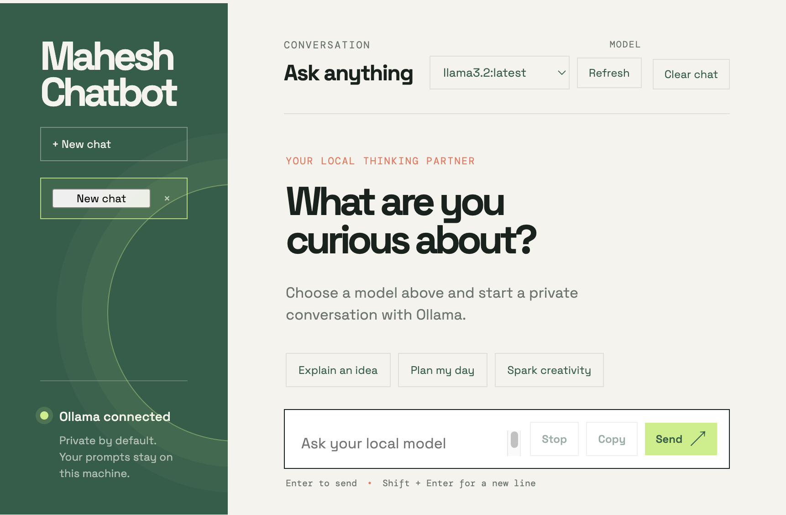

# Mahesh Chatbot

A small private chat app for asking questions to models running on your computer through Ollama.



## Run it

Make sure Ollama is installed and running. From the repository root:

```bash
cd local-ollama-chat
python server.py
```

Open http://localhost:8000 in your browser.

The app discovers models already installed in Ollama. For example:

```bash
ollama pull llama3.2
ollama list
```

## How it works

- The browser sends chat messages to the local Python server.
- The server forwards them to Ollama's local API at `http://127.0.0.1:11434`.
- Ollama streams the response back as newline-delimited JSON.
- No cloud API key is needed and prompts stay on this machine.
